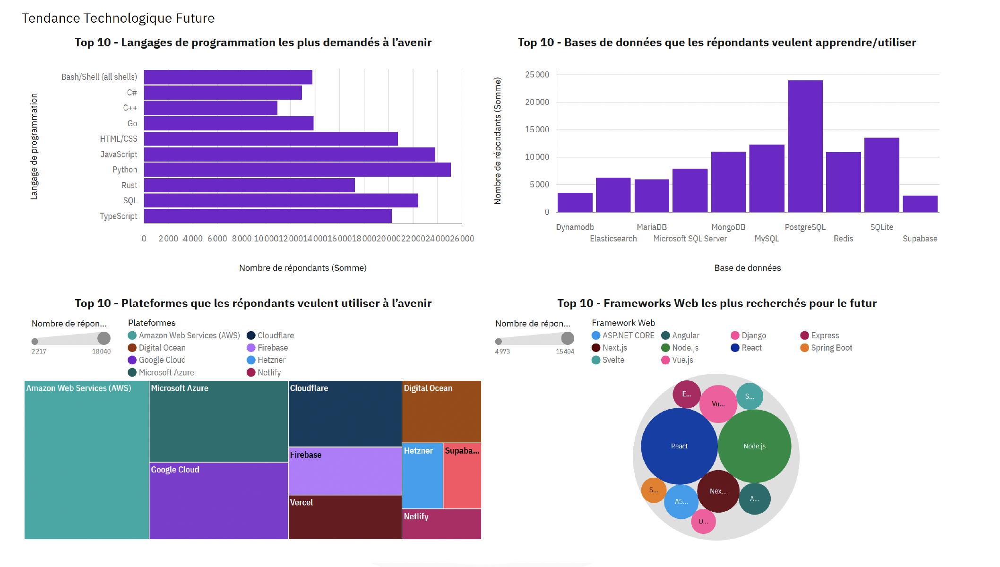

# IBM Data Analyst Capstone Project

  
  
  
  
  
  
  
  
  

---

## À propos du projet
Analyse des résultats de l’**enquête Stack Overflow Developer Survey** pour identifier :  
- Les **langages de programmation, bases de données et frameworks web** les plus utilisés et ceux souhaités pour l’avenir  
- Les **tendances technologiques** et compétences émergentes  
- Les **profils démographiques des développeurs** (âge, pays, niveau d’éducation)

## Objectif
Fournir des insights pour orienter :  
- Les **programmes de formation**  
- Les **stratégies de recrutement**  
- L’**anticipation des besoins technologiques**

## Méthodologie
- Extraction et collecte de données : CSV, API et web scraping  
- Nettoyage et préparation : gestion des valeurs manquantes, suppression des doublons, structuration  
- Analyse exploratoire : distributions, tendances et corrélations  
- Visualisation : Python (Pandas, Matplotlib, Seaborn), IBM Cognos Analytics

## Tableaux de bord
Créés avec **IBM Cognos Analytics** :  
1. Utilisation actuelle de la technologie  
2. Tendances technologiques futures  
3. Profil démographique des répondants  

 

L’ensemble de données utilisé provient de la **Stack Overflow Developer Survey**.  
Le fichier CSV original est disponible ici : [Télécharger survey_data_updated.csv](https://cf-courses-data.s3.us.cloud-object-storage.appdomain.cloud/HLOosvsPgIwt5dgOOh1RSg/survey-data-updated.csv)

## Résultat final
Le projet met en avant l’importance de la **veille technologique**, de l’adaptabilité et de l’analyse de données pour guider les décisions stratégiques et les investissements futurs.

---

## 👤 Auteur

- [Kenza Djeddi Ali](https://www.linkedin.com/in/kenza/)

---
